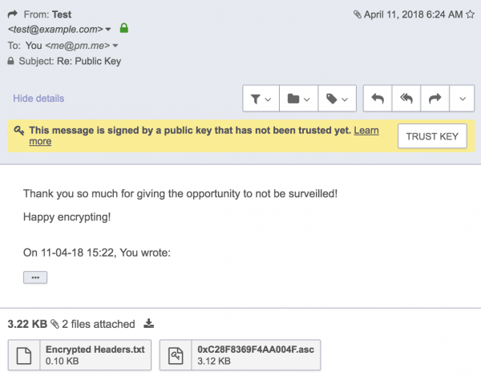

# Шифрование писем электронной почты с помощью PGP

**PGP - это криптографический метод, который позволяет людям конфиденциально общаться в Интернете.** Когда вы отправляете сообщение с помощью PGP, оно преобразуется в нечитаемый зашифрованный текст на вашем устройстве перед передачей через Интернет. Только у получателя есть ключ для преобразования текста обратно в читаемое сообщение на своем устройстве. PGP также проверяет подлинность адреса отправителя и проверяет, что сообщение не было подделано при передаче.

До PGP ваш интернет-провайдер, провайдер электронной почты, хакеры или правительство теоретически могли читать ваши сообщения. PGP был разработан в 1990-х годах, чтобы обеспечить конфиденциальный обмен электронной почтой и другими типами сообщений. Сегодня PGP стандартизирован в OpenPGP, что позволяет любому писать программное обеспечение, совместимое с другими реализациями. Множество библиотек для разработчиков, совместимых с OpenPGP, были созданы, чтобы помочь программистам реализовать шифрование PGP в своих приложениях.

## Как работает
### Шифрование

**Первое, что делает PGP, – это генерирует случайный сеансовый ключ.** Этот ключ представляет собой огромное число, которое используется для шифрования и дешифрования содержимого сообщения. Только тот, кто знает сеансовый ключ, может прочитать сообщение, и он слишком длинный, чтобы его можно было угадать. Ключ сеанса также никогда не используется повторно для других сообщений.

**Затем сеансовый ключ шифруется с использованием открытого ключа получателя.** Открытый ключ уникален для каждого человека и предназначен для совместного использования. Поскольку он не меняется, ваш открытый ключ похож на адрес электронной почты. Он привязан к вам, и любой может использовать его для отправки вам зашифрованного сообщения.

Открытый ключ каждого человека соответствует его закрытому ключу, который является секретным. **В PGP, когда получатель получает зашифрованное сообщение, он расшифровывает сеансовый ключ, используя свой закрытый ключ. Затем сеансовый ключ расшифровывает сообщение.**

Вы можете задаться вопросом, почему PGP делает дополнительный шаг по шифрованию сообщения и сеансового ключа. Это связано с тем, что криптография с открытым ключом намного медленнее, чем симметричная криптография, особенно для больших сообщений. Для шифрования и дешифрования больших электронных писем или файлов непосредственно с использованием открытого ключа потребуется слишком много времени и вычислительной мощности. Но симметричная криптография без криптографии с открытым ключом менее удобна, потому что вам нужно как-то поделиться сеансовым ключом с получателем. Сделать это в открытом виде было бы небезопасно, а делать это через другой зашифрованный канал или лично было бы непрактично. Таким образом, **PGP сочетает в себе эффективность симметричного шифрования и удобство шифрования с открытым ключом.**

### Цифровые подписи

Цифровая подпись доказывает получателю, что злоумышленник не манипулировал содержимым сообщения или адресом отправителя. Это достигается путем создания уникального номера (цифровой подписи) с использованием комбинации закрытого ключа отправителя и математической редукции (известной как дайджест сообщения) открытого текста сообщения. Если закрытый ключ или сообщение изменены, цифровая подпись недействительна.

## Как использовать
### Mailvelope

[Mailvelope](https://www.mailvelope.com/) – это дополнение к браузеру (Chrome, Firefox, Edge), с помощью которого вы сможете использовать PGP с существующим почтовым адресом у стороннего провайдера (например, GMail).

[Подробный гайд по использованию Mailvelope](https://safe.roskomsvoboda.org/mailvelope/) уже есть у наших коллег и РосКомСвободы.

### Mozilla Thunderbird

[Thunderbird](https://www.thunderbird.net/) – это программа для работы с электронной почтой. С помощью неё вы сможете использовать PGP с существующим почтовым адресом у стороннего провайдера (например, GMail). Вот [инструкция по использованию OpenPGP](https://support.mozilla.org/ru/kb/openpgp-v-thunderbird-instrukcii-po-ispolzovaniyu-) в ней.

### Protonmail

[Protonmail](https://protonmail.com) – сервис веб-почты с встроенным шифрованием. Все сообщения между его пользователями используют PGP по умолчанию.

#### Получение писем

Если вам нужно получить письмо от пользователя другого почтового сервиса, необходимо передать ему ваш публичный ключ.

Например, вы можете отправить его в письме. Для этого войдите в свою учётную запись и создайте сообщение. В раскрывающемся меню убедитесь, что пункт "Присоединить публичный ключ" ("Attach Public Key") выбран и отправьте письмо.

Теперь получатель сможет обработать это сообщение в своём почтовом клиенте. Часто клиент PGP автоматически просит импортировать прикреплённый ключ.

Также можно автоматически раздавать ваши открытые ключи всем получателям каждый раз, когда вы отправляете электронное письмо. Для этого перейдите в "Настройки" → "Безопасность". Прокрутите вниз и включите опцию "Автоматически присоединять публичный ключ" ("Automatically attach public key").

Ещё один способ увидеть ваши открытые ключи, позволяющий распространять их другим методом – перейти в "Настройки" → "Ключи" и скопировать его оттуда.

#### Отправка писем

Настроить ProtonMail для автоматической шифрации сообщений, отправленных определенному получателю, не являющемуся пользователем ProtonMail, можно либо вручную, загрузив открытый ключ получателя в менеджер контактов ProtonMail, либо попросив контакт отправить вам электронное письмо с прикрепленным открытым ключом.

Если вы получите сообщение, которое должным образом криптографически подписано от вашего контакта с прикрепленным открытым ключом, вы увидите что-то похожее на это:

Чтобы разрешить отправку электронной почты PGP этому контакту, нажмите "Ключ доверия". Во всплывающем окне обязательно включите "Использовать для шифрования". Затем нажмите "Trust Key" во всплывающем окне.

Теперь между Protonmail и внешним адресом электронной почты установлено шифрование PGP.

Если ваш собеседник отправил вам ключ иным способом, то можно импортировать его при создании контакта.
